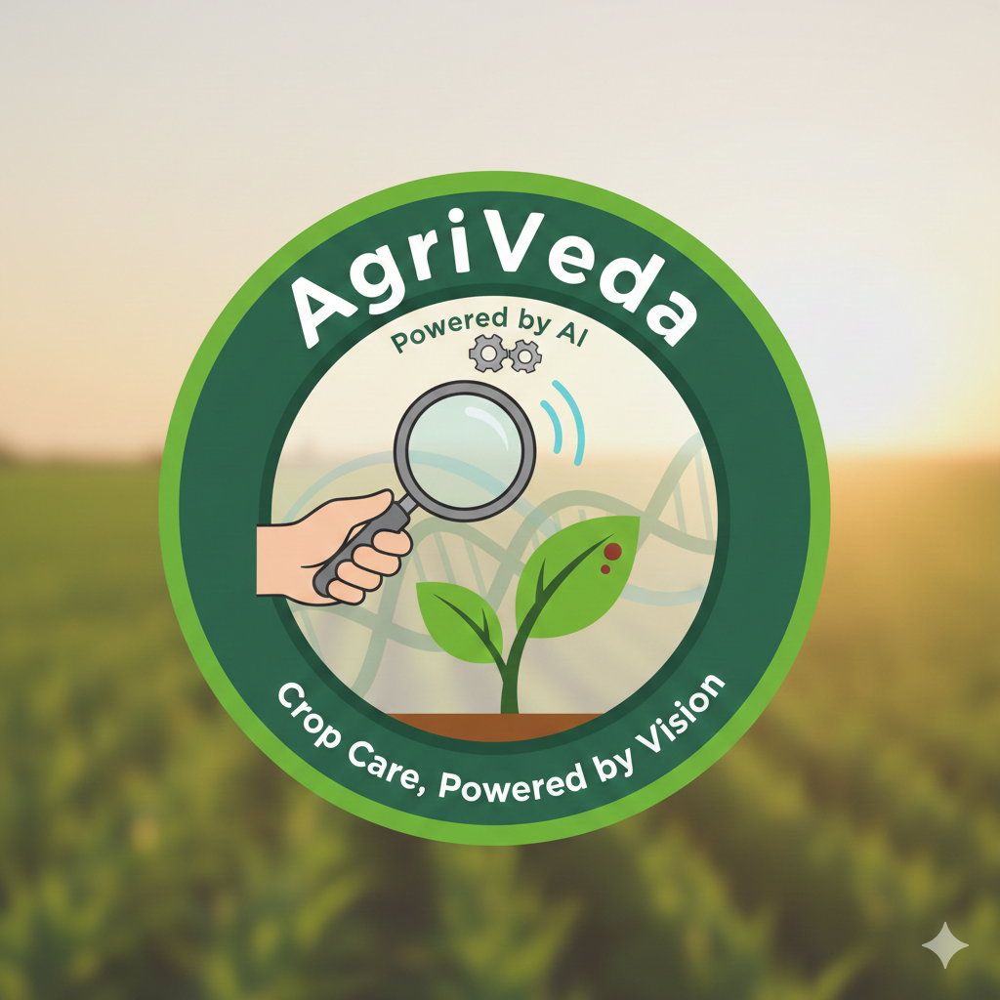

<div align="center">

# 

# 🌾 AgriVeda — AI Crop Assistant & Disease Detection

[](https://expo.dev)
[](https://reactnative.dev)
[](https://www.typescriptlang.org/)
[](https://developer.android.com/)
[](https://developer.apple.com/ios/)
[](#)

</div>

An AI-powered mobile app that helps farmers diagnose crop diseases, plan cultivation, and access critical agri-services—built with React Native (Expo), on-device TFLite inference, and Gemini-powered insights.

👥 Made by: Rudransh Dubey, Vdhisha Mhatre, Vinayak Pandey, Muskan Pandey  
🎓 Event: IEEE Techithon 2026, organized by Atharva University on 28 January 2026

**🌟 Highlights**
- 🧠 On-device disease detection using TFLite (private, fast, offline)
- 🤖 Crop recommendations and cultivation tips powered by Gemini
- ☁️ Weather, 📈 market prices, 🏛️ schemes, and 📚 learning modules
- 💬 Community and chats, plus basic local auth (offline‑friendly)
- 🌓 Full dark/light theme, हिन्दी/मराठी/English localization, smooth UI

**🌾 Features**
- 🩺 Disease Detection: Capture/upload images, on‑device inference, diagnosis + confidence
- 🗂️ Scan History: Offline‑first log (SQLite), later sync‑capable
- 🌱 Crops Intelligence: Location/season/soil‑based recommendations (Gemini)
- 🌤️ Weather: Auto location weather + city search (Open‑Meteo)
- 🛒 Market & 🏛️ Schemes: Bundled data, API‑ready
- 📖 Learning & Tips: Disease library and practical guidance
- 🗣️ Community & 💬 Chats: MVP flows for collaboration
- 🔐 Auth: Lightweight local registration/login for demos and offline
- 📶 Offline Mode: Cache + persistence with SQLite and AsyncStorage

**🚀 Getting Started**
 - Prerequisites: Node 18+, Android Studio or Xcode (for Dev Client), Git.
 - Install dependencies:
```bash
npm install
```
 - Run (non-ML features):
```bash
npm start
```
 - Run with on-device ML (Dev Client required):
```bash
npx expo prebuild --clean
npx expo run:android
npm start -- --dev-client
```
 - iOS (Dev Client):
```bash
npx expo run:ios
npm start -- --dev-client
```
 - Notes:
  - Expo Go will NOT load the native TFLite module. Use a Dev Client.
  - First Dev Client build takes longer; subsequent runs are fast.

**🔧 Environment**
- EXPO_PUBLIC_API_URL: Base URL of optional backend (no trailing /api). Examples:
  - Physical device: http://YOUR-LAN-IP:8000
  - Android emulator: http://10.0.2.2:8000
  - iOS simulator: http://localhost:8000
  - If unset and running in native dev, the app tries to infer your LAN IP.
- EXPO_PUBLIC_GEMINI_API_KEY: Required for Gemini features (crop suggestions, tips).
- EXPO_PUBLIC_GEMINI_MODEL (optional): Defaults to gemini-1.5-flash-latest.

**🧾 Example .env**
```env
EXPO_PUBLIC_API_URL=http://10.0.2.2:8000
EXPO_PUBLIC_GEMINI_API_KEY=your_key_here
EXPO_PUBLIC_GEMINI_MODEL=gemini-1.5-flash-latest
```

**🧪 On‑Device ML**
- Runtime: react-native-fast-tflite (Dev Client required).
- Models: assets/models/plant_disease.tflite, assets/models/crop_disease_model.tflite
- Preprocessing: Center resize to 224×224, JPEG decode to RGB, Float32 input, no /255 normalization (values 0–255) as per lib/ml/imagePreprocess.ts.
- Inference: Single‑image, top‑1 selection from class logits; see lib/ml/diseaseClassifier.ts.
- Errors: If TFLite module is missing, guidance is shown to rebuild a Dev Client.

**📱 Core Screens**
- Home: Quick actions, weather snapshot, navigation to core features.
- Detect: Camera/gallery, on-device classification, best‑shot guidance.
- History: Offline scan log with timestamps and confidence.
- Crops: Gemini recommendations by location/month/soil.
- Weather: Current temp/humidity/soil moisture, rain probability.
- Market Prices: Commodity prices (local data; API‑ready).
- Schemes: Government scheme listings (local data; API‑ready).
- Diseases Library: Browse diseases, symptoms, and remedies.
- Community & Chats: MVP flows for collaboration and Q&A.
- Auth: Register/login (local, demo‑grade) and profile basics.

**🏗️ Architecture**
- App: React Native (Expo SDK 54), TypeScript, Expo Router.
- UI: NativeWind (Tailwind), Reanimated, Lucide icons.
- Data: React Query, AsyncStorage, SQLite (expo-sqlite).
- ML: TFLite via react-native-fast-tflite, custom preprocess pipeline.
- AI: @google/generative-ai (Gemini) for crop planning and tips.
- i18n: i18next + react-i18next with English, Hindi, Marathi.

**🛡️ Permissions**
- Camera and Media Library (image capture/selection).
- Location (weather by current area; optional and privacy‑respecting).

**⚙️ Configuration Notes**
- Babel: Ensure react-native-reanimated/plugin is last in babel.config.js.
- Tailwind: content globs include ./app and ./components.
- Android: For local backend testing, prefer http://10.0.2.2:8000.

Examples:

```js
// babel.config.js
module.exports = function (api) {
  api.cache(true);
  return {
    presets: ["babel-preset-expo"],
    plugins: [
      "nativewind/babel",
      "react-native-reanimated/plugin", // Must be last
    ],
  };
};
```

```js
// tailwind.config.js
module.exports = {
  content: [
    "./app/**/*.{js,jsx,ts,tsx}",
    "./components/**/*.{js,jsx,ts,tsx}",
  ],
  theme: { extend: {} },
  plugins: [],
};
```

**📁 Project Structure (High‑Level)**
- app/: Screens via Expo Router (tabs: home, detect, history, learn, guidance, crops, weather, market-prices, schemes, marketplace, diagnosis, diseases, community, chats, auth)
- lib/: API client, ML pipeline, AI (Gemini), offline DB, i18n, data
- components/: UI primitives (Toast, Themed), utilities
- assets/: fonts, images, TFLite models
- providers/: App‑wide providers
- constants/: Colors and theme

**🗺️ Roadmap**
- Improve model accuracy and on‑device post‑processing.
- Backend sync for scan history and community posts.
- Push notifications and in‑app updates for disease alerts.
- Image quality checks and guided capture overlay.
- Role‑based features for agronomists/co‑ops.

**🙏 Attribution**
- This is a hackathon project made by Rudransh Dubey, Vdhisha Mhatre, Vinayak Pandey, and Muskan Pandey at IEEE Techithon 2026, organized by Atharva University on 28 January 2026.

**🤝 Contributing**
- Issues and pull requests are welcome. Please open an issue to discuss major changes.

**⚠️ Status**
- Hackathon prototype; educational use only. Not medical advice.
